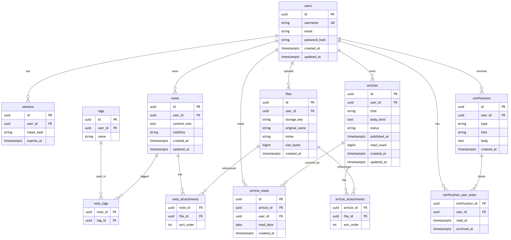
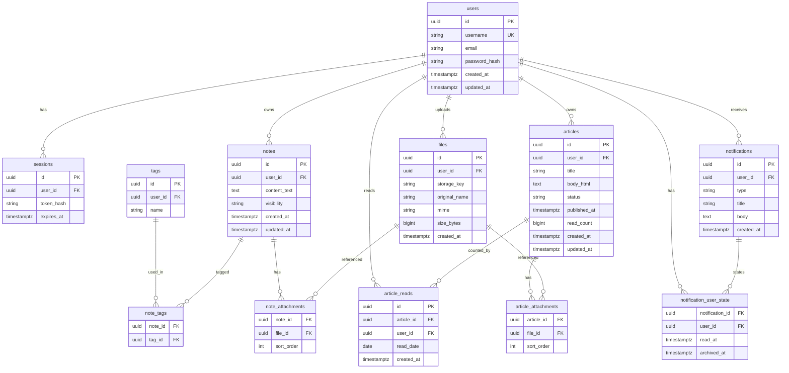

# 数据库设计（YesOPC / Web Admin 域）

本文描述后台与内容域的**逻辑模型**，可与 PostgreSQL / MySQL 等关系型数据库对齐。动态与文章**分表存储正文**；文章阅读量采用 **「每用户每篇每天只计 1 次」** 的去重策略。

---

## 1. 设计原则

| 原则 | 说明 |
|------|------|
| 动态与文章分离 | `notes` 存短内容；`articles` 存长文与富文本，字段互不混用 |
| 阅读量防刷 | 明细表 `article_reads` + 唯一约束 `(article_id, user_id, read_date)`，`read_count` 仅在一次有效插入后递增 |
| 可扩展用户 | 所有内容表带 `user_id`（作者/所有者），便于后续多租户或权限 |
| 附件解耦 | `files` 存对象存储元数据，通过关联表挂到文章或动态 |

**日期边界**：`read_date` 建议使用业务时区（如 `Asia/Shanghai`）下的**日历日**（`DATE`），与 UTC 自然日区分在文档/代码中写清。

---

## 2. ER 图

### 2.1 PNG 图片（已导出）

Mermaid 本质是**文本**，要得到位图需在本地用 [Mermaid CLI](https://github.com/mermaid-js/mermaid-cli) 渲染。仓库中已包含与 `database-erd.mmd` 同步导出的 **`database-erd.png`**，便于在不支持 Mermaid 的环境里直接查看。



**重新生成 PNG**（需本机可启动 Chromium；若失败可重试或换网络环境）：

```bash
npx -y @mermaid-js/mermaid-cli -i docs/database-erd.mmd -o docs/database-erd.png -b white
```

### 2.2 Mermaid 源码（GitHub / VS Code 等可渲染）

在支持 Mermaid 的 Markdown 预览中可渲染下图；修改 ER 后请同步更新 `database-erd.mmd` 并重新导出 PNG。



---

## 3. 表清单与字段说明

### 3.1 `users`（用户）

| 列 | 类型 | 约束 | 说明 |
|----|------|------|------|
| `id` | UUID / BIGINT | PK | |
| `username` | VARCHAR | UNIQUE, NOT NULL | 登录名 |
| `email` | VARCHAR | UNIQUE, 可空 | |
| `password_hash` | VARCHAR | 可空 | 若走 OAuth 可空 |
| `created_at` | TIMESTAMPTZ | NOT NULL | |
| `updated_at` | TIMESTAMPTZ | NOT NULL | |

### 3.2 `sessions`（会话，可选）

| 列 | 类型 | 约束 | 说明 |
|----|------|------|------|
| `id` | UUID | PK | |
| `user_id` | UUID | FK → users | |
| `token_hash` | VARCHAR | NOT NULL | 仅存哈希 |
| `expires_at` | TIMESTAMPTZ | NOT NULL | |

若使用 JWT 无服务端 session，可省略此表。

---

### 3.3 `notes`（动态 / 备忘录，正文独立存储）

| 列 | 类型 | 约束 | 说明 |
|----|------|------|------|
| `id` | UUID | PK | |
| `user_id` | UUID | FK → users, NOT NULL | 作者 |
| `content_text` | TEXT | NOT NULL | 短文本；若需富文本可改为 JSON |
| `visibility` | VARCHAR | NOT NULL | 如 `private` / `public` |
| `created_at` | TIMESTAMPTZ | NOT NULL | |
| `updated_at` | TIMESTAMPTZ | NOT NULL | |

**索引建议**：`(user_id, created_at DESC)`。

---

### 3.4 `tags` / `note_tags`（标签）

**`tags`**

| 列 | 类型 | 说明 |
|----|------|------|
| `id` | UUID | PK |
| `user_id` | UUID | FK；若标签全局共享可改为可空并加唯一 `(name)` |
| `name` | VARCHAR | 与 `user_id` 组合唯一 |

**`note_tags`**

| 列 | 类型 | 说明 |
|----|------|------|
| `note_id` | UUID | FK → notes |
| `tag_id` | UUID | FK → tags |
| | | PK `(note_id, tag_id)` |

---

### 3.5 `articles`（文章，正文与动态分离）

| 列 | 类型 | 约束 | 说明 |
|----|------|------|------|
| `id` | UUID | PK | |
| `user_id` | UUID | FK → users | 作者 |
| `title` | VARCHAR | NOT NULL | |
| `body_html` | TEXT | NOT NULL | 富文本 HTML（或并存 `body_delta`） |
| `status` | VARCHAR | NOT NULL | `draft` / `published` |
| `published_at` | TIMESTAMPTZ | 可空 | 发布时刻 |
| `read_count` | BIGINT | NOT NULL, DEFAULT 0 | 展示用冗余计数 |
| `created_at` | TIMESTAMPTZ | NOT NULL | |
| `updated_at` | TIMESTAMPTZ | NOT NULL | |

**索引建议**：`(user_id, status, updated_at DESC)`。

---

### 3.6 `article_reads`（阅读量明细，防刷核心）

**业务规则**：同一 `user_id` 对同一 `article_id` 在同一 `read_date`（业务日）仅允许 **一条** 记录；插入成功视为当日首次有效阅读，再对 `articles.read_count` 加一。

| 列 | 类型 | 约束 | 说明 |
|----|------|------|------|
| `id` | UUID | PK | |
| `article_id` | UUID | FK → articles, NOT NULL | |
| `user_id` | UUID | FK → users, NOT NULL | 读者；未登录不计入本表时需单独方案 |
| `read_date` | DATE | NOT NULL | 业务时区下的日期 |
| `created_at` | TIMESTAMPTZ | NOT NULL | 首次计入时间 |

**唯一约束（必须）**：

```sql
UNIQUE (article_id, user_id, read_date)
```

**可选规则**：`user_id = articles.user_id` 时跳过插入（作者自己阅读不计入）。

---

### 3.7 `notifications` / `notification_user_state`

**`notifications`**

| 列 | 类型 | 说明 |
|----|------|------|
| `id` | UUID | PK |
| `user_id` | UUID | FK，接收人 |
| `type` | VARCHAR | 业务类型 |
| `title` | VARCHAR | |
| `body` | TEXT | |
| `created_at` | TIMESTAMPTZ | |

**`notification_user_state`**（每用户每通知一行，或合并到宽表）

| 列 | 类型 | 说明 |
|----|------|------|
| `notification_id` | UUID | FK |
| `user_id` | UUID | FK |
| `read_at` | TIMESTAMPTZ | NULL = 未读 |
| `archived_at` | TIMESTAMPTZ | NULL = 未归档 |

PK：`(notification_id, user_id)`。

---

### 3.8 `files` / `article_attachments` / `note_attachments`

**`files`**

| 列 | 类型 | 说明 |
|----|------|------|
| `id` | UUID | PK |
| `user_id` | UUID | 上传者 |
| `storage_key` | VARCHAR | 对象存储路径 |
| `original_name` | VARCHAR | 原始文件名 |
| `mime` | VARCHAR | |
| `size_bytes` | BIGINT | |
| `created_at` | TIMESTAMPTZ | |

**`article_attachments`**：`article_id`, `file_id`, `sort_order`，PK `(article_id, file_id)`。

**`note_attachments`**：`note_id`, `file_id`, `sort_order`，PK `(note_id, file_id)`。

---

## 4. 阅读量写入流程（与库一致）

1. 解析当前用户；可选排除作者本人。  
2. `read_date := 当前时刻按业务时区取日历日`。  
3. `INSERT INTO article_reads (...)`；若违反唯一约束 → 当日已计过，**不**增加 `read_count`。  
4. 插入成功 → `UPDATE articles SET read_count = read_count + 1 WHERE id = ?`（建议同事务或可靠异步）。

---

## 5. 相关文件

| 文件 | 说明 |
|------|------|
| `docs/database-erd.png` | ER 图 **PNG**（由 `.mmd` 导出，提交到仓库） |
| `docs/database-erd.mmd` | Mermaid **源码**，与本文档内 `erDiagram` 保持一致 |
| `docs/database-design.md` | 本设计说明 + 内嵌 Mermaid |
